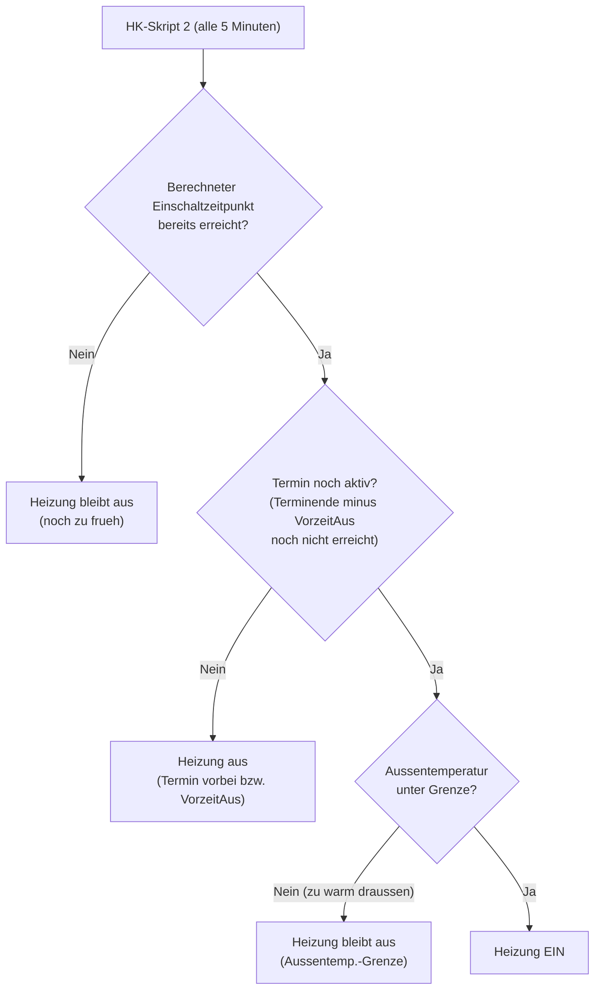

# Anwenderhandbuch

Dieses Handbuch richtet sich an Gemeinde-Administratoren, die den Heizkalender
betreiben und konfigurieren. Es erklärt die wiederkehrenden Aufgaben im laufenden
Betrieb: Räume benennen, das Heizverhalten über die Vorheizzeit einstellen und
einzelne Termine mit Sonderbefehlen steuern.

Für die Erstinstallation siehe die
[Installer-Anleitung](../HeizkalenderInstallation/Dokumentation/Readme.md).
Die vollständige Liste aller Systemvariablen steht in der
[Skript-Referenz](../Skripte/Dokumentation/Readme.md).

## Räume benennen (Raumvariablen)

Jeder Raum wird über eine Systemvariable mit dem Namensschema
`HKG-Raum-<Name>` abgebildet, zum Beispiel `HKG-Raum-GrSaal` oder
`HKG-Raum-Foyer`. Diese Variablen werden normalerweise bei der Installation
automatisch angelegt.

Der Wert einer Raumvariablen ist eine semikolongetrennte Liste mit folgenden
Feldern:

```txt
Status;Modus;Heiztyp;Wohlfühltemp[/Grundtemp];Vorheizzeit[*Faktor];VorzeitAus[;Heizgruppe:Name:N]
```

| Feld | Bedeutung |
| :--- | :--- |
| Status | `0` = keine Heizphase, `1` = Raum ist in einer Heizphase |
| Modus | `H` = Heizen, `S` = Schalten, `HS` = Heizen und Schalten kombiniert |
| Heiztyp | Gerätetyp-Kennung des Aktors: `IP` (Homematic IP Thermostat), `RT`, `TC`, `IT` (Klassik-Thermostate), `SW` (Schalt-Aktor) |
| Wohlfühltemp | Zieltemperatur während des Termins, optional mit `/Grundtemp` für eine abweichende Grundtemperatur |
| Vorheizzeit | Individuelle Vorheizzeit in Minuten, optional mit `*Faktor` (siehe unten) |
| VorzeitAus | Minuten, um die vor Terminende abgeschaltet wird |
| Heizgruppe | Optional: `Heizgruppe:Name:N` zur Zuordnung mehrerer Aktoren |

Beispielwert: `0;H;IP;18;0;30` bedeutet: kein aktives Heizen, Modus Heizen,
Homematic-IP-Thermostat, Wohlfühltemperatur 18 °C, keine zusätzliche individuelle
Vorheizzeit, 30 Minuten vor Terminende abschalten.

### Mehrere Räume gemeinsam schalten

In der Variablen `HK2-HKG-Liste` lassen sich mehrere Räume mit einem `+`-Zeichen
zu einer gemeinsam geschalteten Einheit zusammenfassen; verschiedene
Einheiten werden mit `;` getrennt. Jeder Raum behält dabei seine eigene
Raumvariable mit eigener Vorheizzeit und Wohlfühltemperatur.

Beispiel: `HKG-Raum-GrSaal+HKG-Raum-Foyer+HKG-Raum-WCs;HKG-Raum-KlSaal`
fasst Großen Saal, Foyer und WCs zusammen; der Kleine Saal bildet eine eigene
Einheit.

## Vorheizzeit

Die Vorheizzeit bestimmt, wie lange vor Terminbeginn ein Raum von der
Grundtemperatur auf die Wohlfühltemperatur gebracht wird. Sie setzt sich aus zwei
Anteilen zusammen:

1. der **individuell** in der Raumvariablen definierten Vorheizzeit und
2. der **automatisch aus der Außentemperatur** errechneten Vorheizzeit
   (über die Heizkurve `HK2-Kurve`).

Ist ein Raum zu Beginn bereits wärmer als die Grundtemperatur (z.B. durch einen
vorhergehenden Termin, Nachbarräume oder Sonneneinstrahlung), verkürzt
HK-Skript 2 die Vorheizzeit automatisch. Hat der Raum die Zieltemperatur schon
erreicht, entfällt die Vorheizzeit ganz. Die Neuberechnung erfolgt alle 5 Minuten.

### Wann heizt ein Raum? (Entscheidungsablauf)

HK-Skript 2 prüft alle 5 Minuten für jeden Raum drei Bedingungen. Nur wenn alle
drei erfüllt sind, wird geheizt. Das erklärt die häufige Frage „Warum heizt mein
Raum (nicht)?".



Der Einschaltzeitpunkt selbst ergibt sich aus der Vorheizzeit (siehe oben): je
kälter es draußen und je kühler der Raum, desto früher wird eingeschaltet.

Über den optionalen `*Faktor` hinter der Vorheizzeit lässt sich die aus der
Außentemperatur errechnete Verschiebung skalieren (erlaubt zwischen 0.25 und 3;
ohne oder bei ungültigem Wert gilt Faktor 1.0). Ein Faktor > 1 heizt bei kalter
Außentemperatur steiler vor, z.B. für träge Fußbodenheizungen.

### Die Heizkurve `HK2-Kurve`

Die Heizkurve legt für acht Außentemperatur-Stützpunkte die volle Vorheizzeit
(in Minuten) fest; zwischen den Stützpunkten interpoliert HK-Skript 2 linear.
Der ausgelieferte Default ist:

| Außentemperatur | −10 °C | −5 °C | 0 °C | 8 °C | 10 °C | 12 °C | 15 °C | 17,5 °C |
| :--- | ---: | ---: | ---: | ---: | ---: | ---: | ---: | ---: |
| Vorheizzeit (min) | 162 | 130 | 100 | 59 | 50 | 41 | 30 | 20 |

Diese Werte sollten bei der Installation an das eigene Gebäude angepasst werden.
Eine ausführliche Erklärung der Berechnung mit Beispielrechnungen findet sich in
[Heizsteuerung-Vorheizzeit.md](../Skripte/Dokumentation/Heizsteuerung-Vorheizzeit.md).

> [!NOTE]
> Ob dieser Default-Wert noch aktuell ist, ist ein offener Punkt (siehe
> [TODO.md](../TODO.md)).

## Sonderbefehle in Terminen

Über Sonderbefehle im Termintext lässt sich das Heizverhalten eines einzelnen
Termins steuern. Die Befehle werden in `#...#` eingeschlossen. Groß- und
Kleinschreibung spielt keine Rolle.

## Nachtschaltung

Ist die Systemvariable `HK2-Hand-Grundtemp` auf `true` gesetzt, führt HK-Skript 2
täglich zwischen 00:57 und 01:03 Uhr eine Nachtschaltung durch. Dabei werden alle
Räume aus `HK2-HKG-Liste` geprüft und bei Bedarf zurückgesetzt:

- Räume mit einem aktiven Termin (Schaltzustand „Ein") werden übersprungen.
- Alle übrigen Räume werden auf Grundtemperatur gesetzt: bei Heizräumen
  (HSFlag=H) wird die Solltemperatur am Thermostat gesetzt, bei Schaltaktoren
  (HSFlag=S/HS) wird der Aktor ausgeschaltet.

Die Prüfung und das Schalten erfolgen direkt am Aktor auf der CCU, nicht nur in
der Systemvariablen. Die Nachtschaltung ist eine Absicherung: Wenn ein Termin
nicht sauber ausgeschaltet wurde (z.B. durch einen CCU-Neustart während eines
Termins), stellt sie sicher, dass keine Aktoren dauerhaft eingeschaltet bleiben.

| Systemvariable | Bedeutung |
| :--- | :--- |
| `HK2-Hand-Grundtemp` | `true`: Nachtschaltung aktiv; `false`: deaktiviert |

## Schaltlistenprüfung

Unabhängig von der Nachtschaltung prüft HK-Skript 2 bei jedem Lauf (alle 5 Minuten)
alle Räume aus `HK2-HKG-Liste`. Für jeden Raum mit Schaltzustand „Ein" wird geprüft,
ob in diesem Lauf ein gültiger Schaltlisteneintrag vorhanden war. Fehlt ein solcher
Eintrag, wurde der Termin offenbar gelöscht oder der Ausschaltpunkt wurde verpasst.
Der Raum wird dann sofort zurückgesetzt: die Systemvariable auf Schaltzustand „Aus"
und der Aktor direkt ausgeschaltet.

Die Schaltlistenprüfung ist das Gegenstück zur Nachtschaltung: sie greift sofort im
laufenden Betrieb, während die Nachtschaltung als nächtliche Generalabsicherung dient.

| Befehl | Wirkung |
| :--- | :--- |
| `#EIN#` | Dauerhaft an |
| `#AUS#` | Dauerhaft aus |
| `#RESET#` / `#NORMAL#` | Hebt ein vorheriges `#EIN#`/`#AUS#` wieder auf |
| `#GT#` | Wohlfühltemperatur ignorieren, stattdessen die Grundtemperatur schalten |
| `#NS#` / `#NH#` | Nicht schalten / nicht heizen: der Termin wird nicht in die Schaltliste aufgenommen |
| `#<Zahl>...#` | Setzt die gewünschte Temperatur (0 bis 30 °C, begrenzt durch den Aktor) |

**Anwendungsbeispiel `#NS#`/`#NH#`:** Reinigt eine Firma die Räume, soll die
Ressource als belegt gelten, aber nicht geheizt werden. Mit `#NS#` oder `#NH#`
entscheidet Skript 1, dass dieser Termin nicht in die Schaltliste kommt.

**Wo stehen die Sonderbefehle?**

- **ChurchDesk:** in den „Internen Notizen" des Termins (nicht in der öffentlichen
  Beschreibung, sonst wären sie für alle sichtbar).
- **ChurchTools (iCal), iCal, Google:** Hier werden Sonderbefehle in der
  Terminbeschreibung bzw. im Titel ausgewertet, abhängig von der jeweiligen
  Skript-1-Variante.
