# Heizkalender-Installation

Der Heizkalender -Installer ist ein Tool zur Erstellung von Heizkalendern für die HommMatic, basierend auf Daten aus ChurchTool, ChurchDesk, iCal oder Google Kalender.
Der Installer ermöglicht die Neuinstallation oder auch Updates bestehender Installationen. Er bietet eine benutzerfreundliche Oberfläche zur Konfiguration der Heizkalender und unterstützt die Generierung von Skripten und notwendigen Systemvariablen, die in der HomeMatic CCU oder ähnlichen Systemen verwendet werden können.

## Systemvoraussetzungen

- Betriebssystem: Windows
- Die CCU muss in den Sicherheitseinstellungen den Zugriff auf die Remote Homematic-Script API erlauben. Hier muss entweder ein eingeschränkter Zugriff auf die benötigten Funktionen oder ein vollständiger Zugriff gewährt werden, damit der Installer die notwendigen Skripte und Variablen erstellen kann.
- Ein Administrator Benutzer und das entsprechende Kennwort müssen bekannt sein.
- Alle Skripte die installiert und werden sollen müssen im Programmverezichnis des Heizkalender-Installers liegen. Die Namen sind vorgegeben und dürfen nicht verändert werden. Es können aber weitere Tool-Skripte hinzugefügt werden, die dann ebenfalls aktualisiert werden.
- Um auf Ressourcen und externe Kalender zugreifen zu können , muss der Rechner mit dem Internet verbunden sein.
- Eine Lauffähige Kopie des Installers liegt im Skripte Verzeichnis.

### Vorbereiten der CCU

Damit die Heizkalender-Installation ausgeführt werden kann, muss der Zugriff auf die Homematic-Script-API freigeschaltet werden. Entweder wird hier unter der *HomeMatic-WebUI Einstellungen -> Firewall konfigurieren -> Remote Homematic-Script API -> Vollzugriff* eingestellt
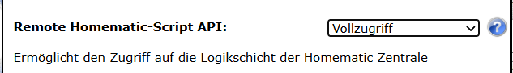

Oder man erteilt *Eingeschränkt*en Zugriff und gibt die entsprechende IP-Adresse für den Zugriff frei.
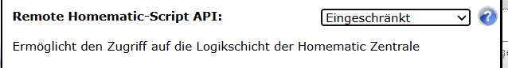
Freigegebene IP für den Zugriff.
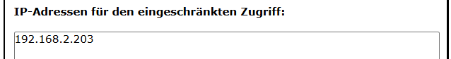

# Verbinden mit der CCU

Im ersten Schritt muss eine Verbindung mit der CCU aufgebaut werden bevor weitere Einstekllungen vorgenommen werden können.

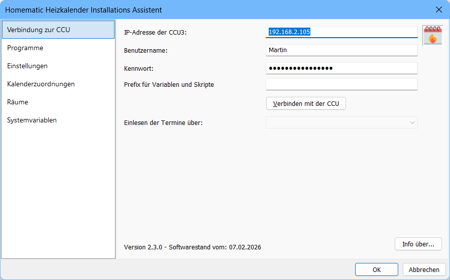

1. Geben Sie die Zeil-IP der CCU an.
2. Geben Sie einen Benutzernamen an, der administrativen Zugriff auf die CCU hat.
3. Geben Sie das passende Kennwort an.

> [!NOTE]
> Das Feld Prefix bleibt im allgemeinen leer. Es dient dazu mehrere Installationen paralell zu testen, oder eine Installation von bestehenden Systemvariablen abzugrenzen.  
> Wird ein Prefix angegeben, erhalten alle Variablen und Programme diesen Prefix im Namen vorangestellt.  
> Wird eine bestehende CCU ausgelesen, wird auch erwartet, dass alle genutzten Variablen und Programme, diesen Prefix enthalten.  
> **Nutzen Sie dieses Feld nur, wenn Sie sich über die Folgen im klaren sind!**

Klicken Sie nun auf den Button `Verbinden mit der CCU`

Ist keine Verbindung zur CCU möglich, weil die Verdindungsinformationen nicht stimmen, erhalten Sie eine Fehlermeldung:
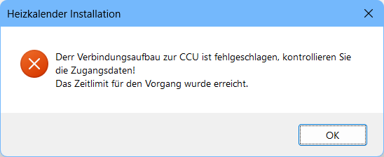

> [!NOTE]
> Konnte eine Verbindung hergestellt werden, dann werden die aktuellen Verbindungsinformationen in der Registry des aktuellen Benutzers gespeichert.  
> Wird die HeizkalenderInstallation neu gestartet sind die Felder. *IP-Adresse, Benutzername, Kennwort, Prefix* bereits ausgefüllt.

# Einrichten einer neuen Heizkalender Installation

Ist bsiher keine Installation auf der CCU vorhanden erhalten Sie die Meldung:
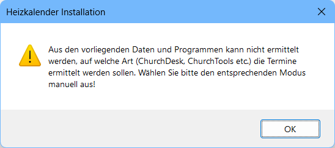

## Auswahl der Ressourcen/Termin Quelle 

Wählen Sie nun die gewünschte Quelle für Ihre Termine (ChurchTools, ChurchDesk, iCal, Google-API):
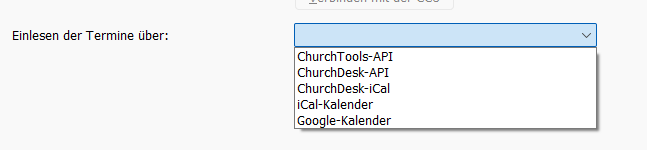

## Verbidndungsdaten zu den Terminen/Ressourcen

Für jede Heizkalender Variante sind unterschiedliche Infromationen für das Auslesen/Aktualisieren der Ressourcen und Kalender notwendig. Diese werden nachfolgend beschreiben.
 
### Verbindungsdaten angeben - ChurchDesk

Die benötigten Zugangsdaten für ChurchDesk sind bei den Varianten API / iCal identisch.

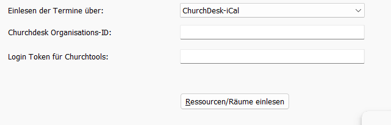
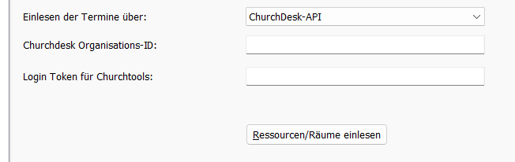

### Verbindungsdaten angeben - ChurchTools

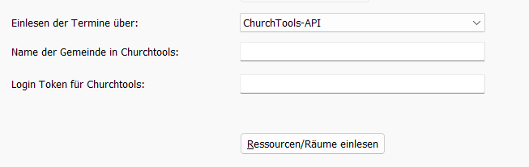

### Verbindungsdaten angeben - iCal

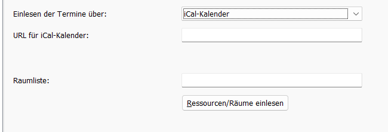

### Verbindungsdaten angeben - Google

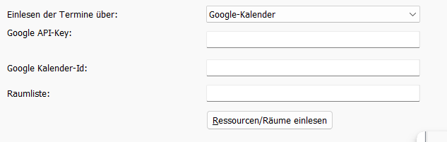

# Nach dem Verbindungsaufbau mit der CCU

Bei einer bestehenden eingerichteten CCU erhalten Sie eine Anzeige über den Verbindungsstatus und die Art der genutzten Ressourcen. Wie es in der nachfolgenden Anzeige zu sehen ist.

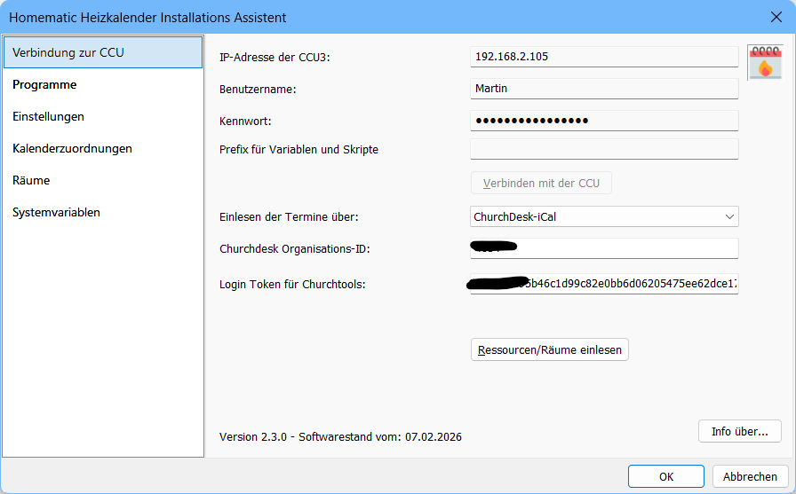

## Wechsel einer zu einer anderen Ressourcen Variante

# Allgemeine Einstellungen des Heizkalenders

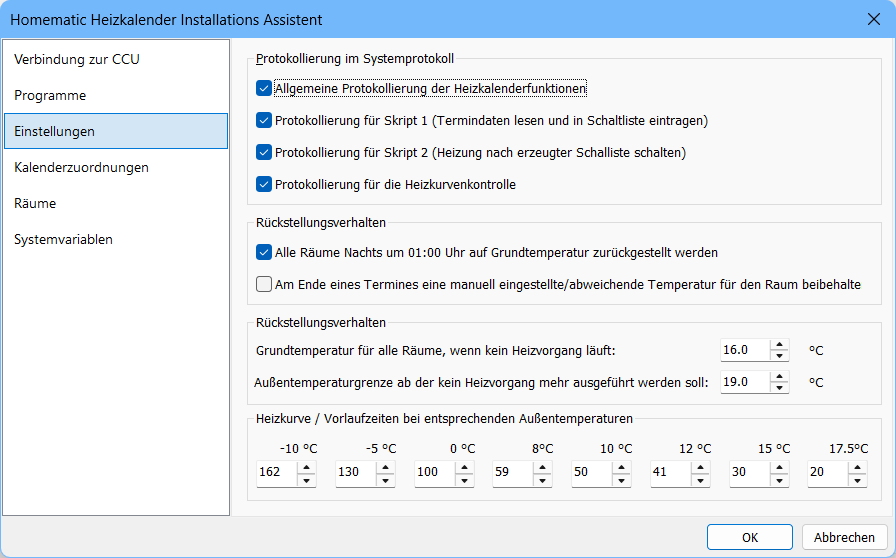

# Ressourcen Kalenderzuordnung

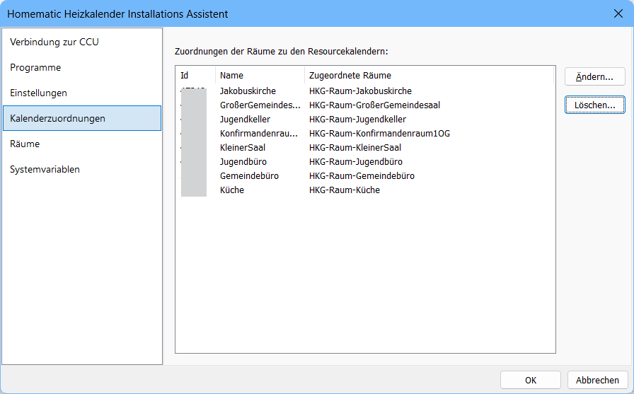

## Raumzuodrnung zu den Ressourcen/Kalendern

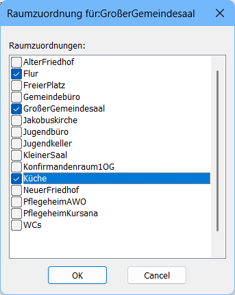

# Programme / Skripte

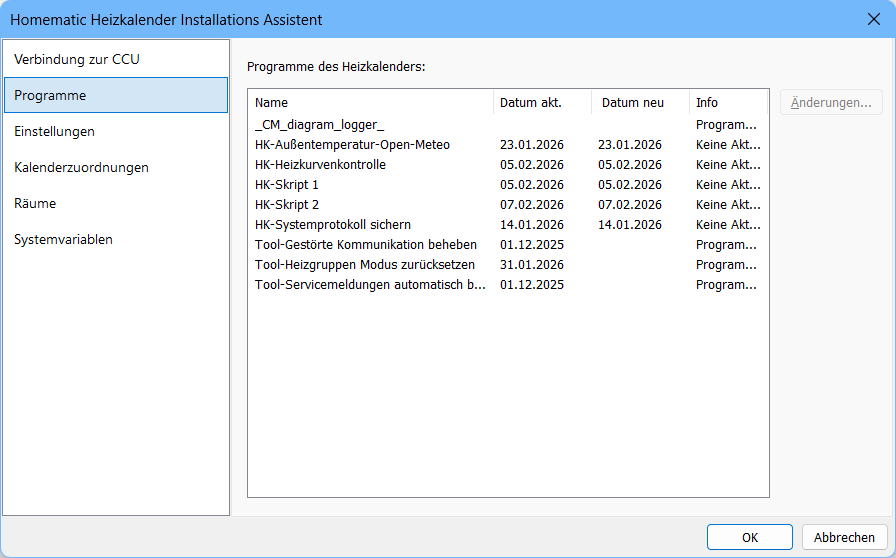

## Möglichkeit Änderungen in Skripten anzuzeigen

# Räume

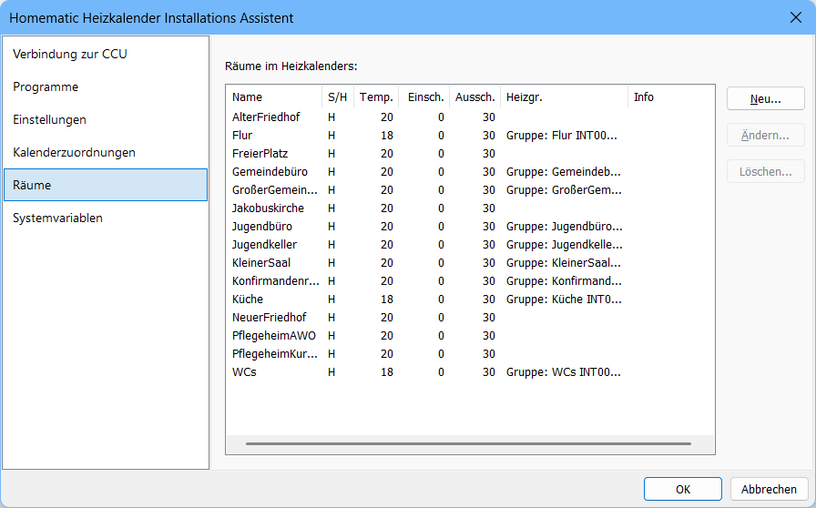

## Eigenschaften von Räumen

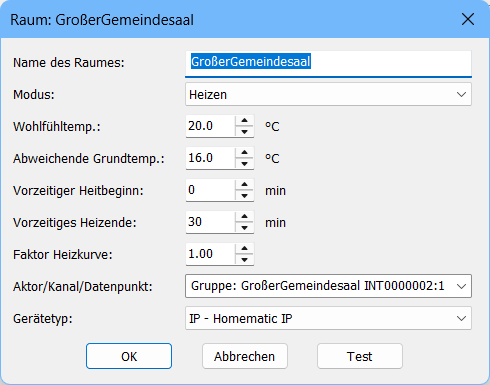

# Systemvariablen

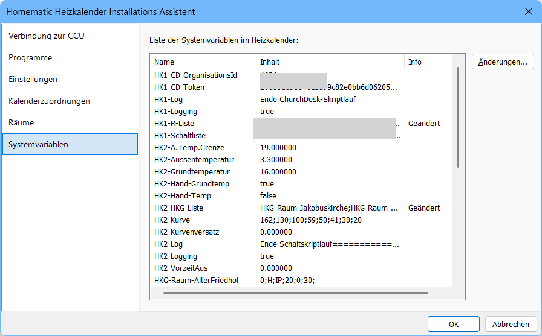

## Änderungsinformationen

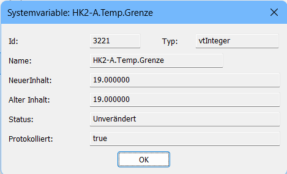
