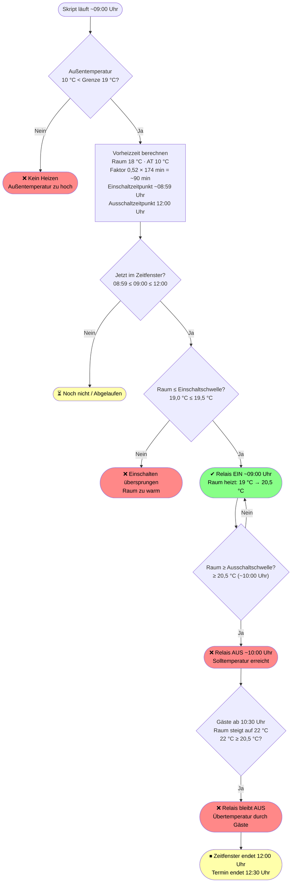

# Heizsteuerung — Vorheizzeit-Logik

Dieses Dokument erklärt, wie das Hauptskript `HK-Skript 2` den Einschaltzeitpunkt der Heizung
berechnet. Es geht dabei nicht um eine Vorlauftemperatur, sondern um eine **ereignisgesteuerte
Zeitsteuerung**: Das Skript berechnet, wie viele Minuten vor einem Termin die Heizung eingeschaltet
werden muss, damit der Raum pünktlich die gewünschte Temperatur erreicht.

## Verarbeitungskette

```txt
Kalender-Skript 1  -->  Schaltliste (HK1-Schaltliste)  -->  Hauptskript 2
                                                                    |
Außentemperatur-Skript  -->  HK2-A.Temp  ------------------------>  |
                                                                    v
                                                           Einschaltzeitpunkt
                                                           berechnen + schalten
```

Das Skript 2 läuft alle **5 Minuten** und trifft die Heizentscheidung jedes Mal neu:

- Liegt der berechnete Einschaltzeitpunkt in der Vergangenheit?
- Liegt der Ausschaltzeitpunkt (Terminende) noch in der Zukunft?
- Ist die aktuelle Außentemperatur unter der konfigurierten Grenze?

Erst wenn alle drei Bedingungen erfüllt sind, wird die Heizung eingeschaltet.

## Systemvariablen (Konfiguration)

| Variable | Bedeutung | Beispielwert |
| :--- | :--- | :--- |
| `HK2-Grundtemperatur` | Absenktemperatur wenn nicht geheizt wird | 10,0 °C |
| `HK2-A.Temp.Grenze` | Heizen wird gestoppt wenn Außentemperatur ≥ Grenze | 19,0 °C |
| `HK2-A.Temp` | Aktuelle Außentemperatur (von Außentemperatur-Skript) | 8,0 °C |
| `HK2-Kurve` | Vorheizzeit-Kurve: 8 Werte für 8 Außentemperatur-Stützpunkte | siehe unten |
| `HK2-VorzeitAus` | Globaler Grund-Offset zum vorzeitigen Ausschalten (Minuten); gilt nur für echte Heizvorgänge, nicht für reine Schaltrelais | 0 min |

## Die Vorheizzeit-Kurve

Die Kurve besteht aus **8 Stützpunkten**, die die volle Vorheizzeit (bei unbeheiztem Raum)
für verschiedene Außentemperaturen angeben. Zwischen den Stützpunkten wird **linear interpoliert**.
Für Außentemperaturen über 17,5 °C extrapoliert das Skript über den letzten Abschnitt hinaus
(begrenzt auf mindestens 0 Minuten).

| # | Außentemperatur | Volle Vorheizzeit | (in h:min) |
| :---: | ---: | ---: | ---: |
| 1 | −10 °C | 451 min | 7 h 31 min |
| 2 | −5 °C | 370 min | 6 h 10 min |
| 3 | 0 °C | 297 min | 4 h 57 min |
| 4 | 8 °C | 196 min | 3 h 16 min |
| 5 | 10 °C | 174 min | 2 h 54 min |
| 6 | 12 °C | 154 min | 2 h 34 min |
| 7 | 15 °C | 125 min | 2 h 05 min |
| 8 | 17,5 °C | 103 min | 1 h 43 min |

_Diese Werte entsprechen der Beispielkonfiguration. Sie werden bei der Installation individuell gesetzt._

## Die Berechnungsformel

Die tatsächliche Vorheizzeit ergibt sich aus dem Kurvenwert multipliziert mit einem
**Korrekturfaktor**, der die aktuelle Raumtemperatur berücksichtigt:

```txt
Vorheizzeit = Kurvenwert(Außentemperatur) × Korrekturfaktor

Korrekturfaktor = 1 − 0,6 × ( (Raumtemperatur − Grundtemperatur) / (Wohlfühltemperatur − Grundtemperatur) )
                              └─ Raumtemperatur wird auf max. Wohlfühltemperatur begrenzt ─┘

Minimum: 0,20 (20 %) — es wird immer mindestens 20 % der Kurvenzeit vorgeheizt
```

**Bedeutung der Parameter:**

| Parameter | Bedeutung |
| :--- | :--- |
| Raumtemperatur | Aktuelle Temperatur laut Thermostat im Raum |
| Grundtemperatur | Absenktemperatur (`HK2-Grundtemperatur`), z. B. 10 °C |
| Wohlfühltemperatur | Gewünschte Zieltemperatur laut Schaltliste, z. B. 20 °C |
| Faktor 0,6 | Fixer Anpassungsfaktor (im Skript hardcodiert) |

**Beispielrechnungen:**

| Raumtemperatur | Korrekturfaktor | Vorheizzeit bei 8 °C Außentemp. (196 min) |
| ---: | ---: | ---: |
| 10 °C (= Grundtemperatur) | 1,00 (100 %) | 196 min (3 h 16 min) |
| 15 °C | 0,70 (70 %) | 137 min (2 h 17 min) |
| 18 °C | 0,52 (52 %) | 102 min (1 h 42 min) |
| 20 °C (= Wohlfühltemperatur) | 0,40 (40 %) | 78 min (1 h 18 min) |
| ≥ 20 °C (wärmer als Ziel) | 0,40 (40 %, gedeckelt) | 78 min (1 h 18 min) |

## Sonderfälle

### Außentemperatur-Grenze (harter Schalter)

Ist die aktuelle Außentemperatur **größer oder gleich** der konfigurierten Grenze (`HK2-A.Temp.Grenze`),
wird die Heizung unabhängig von Termin und Raumtemperatur **nicht eingeschaltet** bzw. sofort
**ausgeschaltet**. Diese Prüfung erfolgt bei jedem 5-Minuten-Lauf neu — ändert sich die
Außentemperatur während eines Termins, reagiert das Skript entsprechend.

Systemprotokoll-Eintrag: _„Heizen abgebrochen Aussentemperatur 21,0 °C größer Grenzwert 19,0 °C“_

### Raum wärmer als Wohlfühltemperatur (40-%-Deckelung)

Ist der Raum bereits wärmer als die gewünschte Wohlfühltemperatur, wird die Raumtemperatur
in der Formel auf die Wohlfühltemperatur **begrenzt**. Der Korrekturfaktor sinkt damit auf
sein Minimum von **0,40 (40 %)**. So wird bei einem bereits warmen Raum immer noch ein
Mindest-Vorlauf sichergestellt — wichtig bei trägen Heizsystemen wie Fußbodenheizungen.

### Kein Thermostat im Raum (Fallback auf Grundtemperatur)

Ist für einen Raum kein Thermostat konfiguriert, kennt das Skript die aktuelle Raumtemperatur
nicht. In diesem Fall wird die **Grundtemperatur** als Raumtemperatur angenommen.

Konsequenz: Der Zähler der Formel wird 0, der Korrekturfaktor beträgt **1,00 (100 %)**,
es wird immer die volle Kurvenzeit vorgeheizt. Dies ist der sicherste Fallback,
führt aber bei niedrig konfigurierter Grundtemperatur zu sehr langen Vorlaufzeiten.

### Übertemperatur im Raum (Modus HS)

Im Modus **HS** (erster Aktor = Thermostat als Temperatursensor, weitere Aktoren = Schaltrelais)
liest das Skript die Raumtemperatur vom Thermostat und nutzt sie für zwei Zwecke:

1. **Vorheizzeit-Berechnung** (Korrekturfaktor, wie bisher)
2. **Laufende Regelung der Schaltrelais** — neu:
   - Raum ≥ Soll + Hysterese → Relais **AUS** (z. B. bei vollem Saal mit 24 °C)
   - Raum ≤ Soll − Hysterese → Relais **EIN** (Raum hat sich wieder abgekühlt)

Mit einer Hysterese von 0,5 °C und Soll = 20 °C ergibt sich ein
**1 °C breites Schaltband** (19,5 °C – 20,5 °C). Da das Skript im 5-Minuten-Takt läuft,
ist ein Relais-Flattern technisch ausgeschlossen.

| Schwelle | Bedingung | Aktion |
| :--- | :--- | :--- |
| Obere Schaltschwelle | Raum ≥ 20,5 °C (Soll + 0,5) | Relais **AUS** |
| Untere Schaltschwelle | Raum ≤ 19,5 °C (Soll − 0,5) | Relais **EIN** |
| Im Band | 19,5 °C < Raum < 20,5 °C | keine Änderung |

Die Hysterese wird **raumspezifisch** im Feld 3 der Raumvariable als dritter Slash-Teil angegeben (`Wohlfühltemp[/Grundtemp[/Hysterese]]`, in °C). Beispiel: `20//0.5` = Soll 20 °C, Grundtemp Standard, Hysterese 0,5 °C. Ein leerer oder fehlender Hysterese-Teil deaktiviert die Funktion für den jeweiligen Raum (Vorgabe: alle Räume aus, gezielt einzelne aktivieren).

Die folgende Tabelle beschreibt das Verhalten je Modus; in dieser Installation nutzen alle
Räume **Modus HS**.

| Modus | Schutz bei Übertemperatur im Raum |
| :--- | :--- |
| **H** (Thermostat) | ✔ Thermostat regelt selbst — Ventil bleibt bei Übertemp. geschlossen |
| **S** (reines Relais) | ✖ Kein Schutz — kein Temperatursensor vorhanden |
| **HS** (Thermostat + Relais) | ✔ Hysterese-Regelung raumspezifisch über Feld 3 (`/Hysterese`) |

## Vorzeitiges Heiz-/Schaltende

Neben dem Einschaltzeitpunkt kann das Skript die Heizung auch **vor dem Terminende** abschalten.
Dafür gibt es zwei Offsets in Minuten, die beide vom Terminende abgezogen werden:

| Offset | Konfiguration | Aktueller Wert |
| :--- | :--- | :--- |
| **Raum-individuell** | Im Installer pro Raum (Feld „Vorzeit Aus“) | 30 min (alle Räume) |
| **Global** | Systemvariable `HK2-VorzeitAus` | 0 min |

```txt
Ausschaltzeitpunkt = Terminende − (Raum-Offset + globaler Grund-Offset)

Beispiel Saal:       Terminende 22:00 − 30 min = 21:30
Beispiel Kellerbüro: Terminende 18:00 − 30 min = 17:30
```

**Hinweise:**

- Der raum-individuelle Offset gilt unabhängig von der Außentemperatur.
- Der globale Offset (`HK2-VorzeitAus`) wird **nur bei echten Heizvorgängen** berücksichtigt, nicht bei reinen Schaltrelais.
- Zweck: Die Wärmeträgheit hält den Komfort bis Terminende aufrecht, obwohl die Heizung früher abschaltet. Spart Energie.

## Use Cases

Die folgenden vier Beispiele zeigen das Zusammenspiel aller Faktoren an einem konkreten Tag.

In dieser Installation laufen **alle Räume im Modus HS** (erster Aktor = Thermostat als
Temperatursensor, weitere Aktoren = Schaltrelais). Die HS-Hysterese-Regelung ist mit
einer Hysterese von 0,5 °C (Feld 3) aktiv.

**Gemeinsame Rahmenbedingungen:**

| Parameter | Wert |
| :--- | :--- |
| Grundtemperatur | 10,0 °C |
| Außentemperatur-Grenze | 19,0 °C |
| Wohlfühltemperatur | 20,0 °C |
| Vorheizzeit-Kurve bei 8 °C | 196 min |
| Vorheizzeit-Kurve bei 18,6 °C (interpoliert) | 93 min |
| Modus (alle Räume) | **HS** |
| Hysterese (Feld 3) | 0,5 °C |

**Außentemperatur-Verlauf des Tages:**

- Morgens: 8 °C
- Ab ca. 13:42 Uhr: ≥ 19 °C (Grenze überschritten)
- 14:00 Uhr: 21 °C
- 18:00 Uhr: 20 °C
- 19:00 Uhr: 18,6 °C

### Use Case 1 — Saal (mit Thermostat, Termin 19:00–22:00)

| Parameter | Wert |
| :--- | :--- |
| Raumtemperatur | 21,1 °C (Thermostat) |
| Außentemperatur um 19:00 Uhr | 18,6 °C |
| Heizen erlaubt? | Ja (18,6 °C < 19 °C) |
| Raumtemperatur in Formel | 20,0 °C (auf Wohlfühltemperatur gedeckelt) |
| Korrekturfaktor | 1 − 0,6 × ((20−10)/(20−10)) = **0,40** |
| Kurvenwert bei 18,6 °C | ~93 min (interpoliert) |
| Vorheizzeit | 0,40 × 93 ≈ **37 min** |
| Einschaltzeitpunkt | ~18:23 Uhr |
| Ausschaltzeitpunkt | 21:30 Uhr (22:00 − 30 min) |

```txt
Zeitachse:
  ~18:23  Heizung EIN
   19:00  Termin beginnt
   21:30  Heizung AUS (Terminende 22:00 − 30 min)
   22:00  Termin endet
```

Der Raum ist bereits überwarm (21,1 °C). Die Formel begrenzt auf 20 °C → Minimalfaktor 40 %.
Da es um 19:00 Uhr mit 18,6 °C knapp unter der Außentemperatur-Grenze liegt, wird geheizt.
Das vorzeitige Schaltende (−30 min) schaltet die Heizung um 21:30 ab — die Wärmeträgheit hält den Komfort bis 22:00 aufrecht.

### Use Case 2 — Bistro (mit Thermostat, Termin 15:00–18:00)

| Parameter | Wert |
| :--- | :--- |
| Raumtemperatur um 14:00 Uhr | 20,4 °C (Thermostat) |
| Außentemperatur um ~13:42 Uhr | ≥ 19 °C |
| Außentemperatur um 14:00 Uhr | 21 °C |
| Heizen erlaubt? | **Nein** (Außentemp. ≥ Grenze bereits zum Vorheiz-Zeitpunkt) |
| Korrekturfaktor | — (wird nicht berechnet) |
| Vorheizzeit | **0 min** |
| Einschaltzeitpunkt | **entfällt** |

```txt
Zeitachse:
  ~13:42  Rechnerischer Vorheiz-Start — ABER Außentemp. bereits >= 19 °C
   15:00  Termin beginnt — Heizung bleibt aus
   18:00  Termin endet
```

Obwohl rechnerisch ~78 Minuten Vorheizzeit benötigt würden (0,40 × 196 min),
verhindert die Außentemperatur-Grenze das Heizen vollständig.
Das Systemprotokoll vermerkt:
_„Heizen abgebrochen Aussentemperatur 21,0 °C größer Grenzwert 19,0 °C“_

### Use Case 3 — Kellerbüro (ohne Thermostat, Termin 08:00–18:00)

| Parameter | Wert |
| :--- | :--- |
| Raumtemperatur (real) | 18–19 °C (aber kein Thermostat konfiguriert) |
| Raumtemperatur in Formel | **10 °C** (Fallback = Grundtemperatur) |
| Außentemperatur morgens | 8 °C |
| Außentemperatur ab ~13:42 | ≥ 19 °C |
| Heizen erlaubt? | Ja (morgens), ab ~13:42 Uhr Nein |
| Korrekturfaktor | 1 − 0,6 × ((10−10)/(20−10)) = **1,00** |
| Kurvenwert bei 8 °C | 196 min |
| Vorheizzeit | 1,00 × 196 = **196 min (3 h 16 min)** |
| Einschaltzeitpunkt | ~04:44 Uhr |
| Ausschaltzeitpunkt | 17:30 Uhr (18:00 − 30 min) — irrelevant, Heizstopp bereits ab ~14:00 |

```txt
Zeitachse:
  ~04:44  Heizung EIN (volle Vorheizzeit wegen Fallback auf Grundtemperatur)
   08:00  Termin beginnt
  ~14:00  Außentemp. >= 19 °C → Heizung AUS (obwohl Termin noch läuft)
   17:30  Heizung AUS (Terminende 18:00 − 30 min) — hier bereits durch Außentemp.-Grenze ab ~14:00 gestoppt
   18:00  Termin endet
```

Im Modus HS erwartet das Skript unter `RVI[6]` einen Thermostat als Temperatursensor.
Ist dort kein Sensor konfiguriert, greift der Code-Guard (`if(SensorAktor && objSensor)`)
und die HS-Hysterese-Regelung wird vollständig übersprungen. Der Raum verhält sich dann
wie ein normaler S-Raum: Fallback auf Grundtemperatur (10 °C) → Korrekturfaktor 1,00 →
volle Kurvenzeit, ganz normales Einschalten ohne Hysterese-Prüfung.
⚠ Hinweis: Auch bei real 18–19 °C Raumtemperatur rechnet das Skript ohne Sensor stets mit
der Grundtemperatur (10 °C). Für eine funktionierenden HS-Regelung ist ein konfigurierter
Thermostat-Sensor unter `RVI[6]` zwingend erforderlich.

### Use Case 4 — Gottesdienstraum (Modus HS, Termin 10:30–12:30)

**Szenario:** Sonntagsgottesdienst. Der Raum ist von 10:30 bis 12:30 Uhr gebucht. Zu
Terminbeginn kommen ca. 100 Gäste und heizen den Raum durch ihre Körperwärme binnen
30 Minuten deutlich auf. Der Raum verfügt über einen konfigurierten Thermostat-Sensor
(`RVI[6]`), Modus HS ist aktiv.

| Parameter | Wert |
| :--- | :--- |
| Termin | 10:30–12:30 Uhr |
| Modus | **HS** |
| Thermostat-Sensor | Ja |
| Grundtemperatur | 10,0 °C |
| Wohlfühltemperatur | 20,0 °C |
| Hysterese (Feld 3) | 0,5 °C → Einschaltschwelle 19,5 °C / Ausschaltschwelle 20,5 °C |
| Raumtemperatur um 04:00 | 18,0 °C (Restwärme vom Vortag) |
| Außentemperatur um 04:00 | 10,0 °C |
| Außentemperatur < AT-Grenze? | **Ja** (10,0 °C < 19,0 °C) |
| HK2-VorzeitAus | 30 min |
| Ausschaltzeitpunkt | 12:00 Uhr (12:30 − 30 min) |

**Berechnung:**

| Rechenschritt | Wert |
| :--- | :--- |
| Kurvenwert bei AT 10,0 °C | **174 min** |
| Korrekturfaktor | 1 − 0,6 × ((18 − 10) / (20 − 10)) = 1 − 0,48 = **0,52** |
| Vorheizzeit | 174 × 0,52 = **~90 min** |
| Einschaltzeitpunkt | 10:30 − 90 min = **~08:59 Uhr** |
| Zeitfenster ab | ~09:00 Uhr (nächster Skript-Lauf nach 08:59) |

**Ablauf:**

Um ~09:00 Uhr erkennt das Skript erstmals, dass der berechnete Einschaltzeitpunkt (08:59)
in der Vergangenheit liegt und das Zeitfenster aktiv ist. Der Raum hat 19,0 °C — das ist
≤ 19,5 °C (Einschaltschwelle) → Relais **EIN**.

Die Heizung erwärmt den Raum weiter. Sobald die Raumtemperatur ≥ 20,5 °C (obere
Hystereseschwelle) erreicht, schaltet das Relais bei ~10:00 Uhr **AUS**.

Ab 10:30 Uhr beginnt der Gottesdienst. Die ca. 100 Gäste erzeugen erhebliche Körperwärme;
die Raumtemperatur steigt bis 11:00 Uhr auf ca. 22 °C. Da 22 °C ≥ 20,5 °C
(Ausschaltschwelle), bleibt das Relais **dauerhaft AUS** — die Hysterese schützt den Raum
vor weiterer Überhitzung.

Um 12:00 Uhr (Ausschaltzeitpunkt = Terminende − 30 min) endet das Zeitfenster endgültig.
Das Relais ist zu diesem Zeitpunkt ohnehin AUS, da die Raumtemperatur noch über 20,5 °C liegt.



```txt
Zeitachse:
  ~09:00  Relais EIN  (Einschaltzeitpunkt 08:59 überschritten, Raum 19,0 °C ≤ 19,5 °C)
  ~10:00  Relais AUS  (Raum ≥ 20,5 °C — obere Hystereseschwelle)
   10:30  Termin beginnt, ~100 Gäste kommen → Raum steigt auf 22 °C
  ~11:00  Raum 22 °C — Relais bleibt AUS (22 ≥ 20,5)
   12:00  Ausschaltzeitpunkt (Terminende 12:30 − 30 min) — Relais ohnehin AUS
   12:30  Termin endet
```

Der Gottesdienstraum zeigt den **vollständigen HS-Lebenszyklus** in einem einzigen Termin:
Vorheizen → Solltemperatur erreicht (Relais AUS) → Übertemperatur durch Gäste (Relais
bleibt AUS). Ohne die HS-Hysterese würde das Relais bis 12:00 Uhr durchheizen und den Raum
trotz 22 °C Gästewärme weiter aufheizen — die Hysterese verhindert genau das.

## Gegenüberstellung der Use Cases

| | Saal | Bistro | Kellerbüro |
| :--- | :--- | :--- | :--- |
| Termin | 19:00–22:00 | 15:00–18:00 | 08:00–18:00 |
| Thermostat | Ja | Ja | **Nein** |
| Raumtemperatur | 21,1 °C | 20,4 °C | 18–19 °C (real, unbekannt) |
| Raumtemperatur in Formel | 20,0 °C (gedeckelt) | — | 10,0 °C (Fallback) |
| Außentemp. zum Vorheiz-Start | 18,6 °C um 19:00 | ≥ 19 °C um ~13:42 | 8 °C um ~04:44 |
| Heizen erlaubt? | **Ja** | **Nein** | **Ja** / ab ~14:00 Nein |
| Korrekturfaktor | 0,40 | — | 1,00 |
| Vorheiz-Anteil | 40 % | 0 % | 100 % |
| Kurvenwert | ~93 min (bei 18,6 °C) | — | 196 min (bei 8 °C) |
| Vorheizzeit | **~37 min** | **—** | **196 min** |
| Einschaltzeitpunkt | ~18:23 Uhr | entfällt | ~04:44 Uhr |
| Vorzeitiges Heizende (−30 min) | 21:30 Uhr | — | 17:30 Uhr (überholt durch Außentemp.-Stop ~14:00) |
